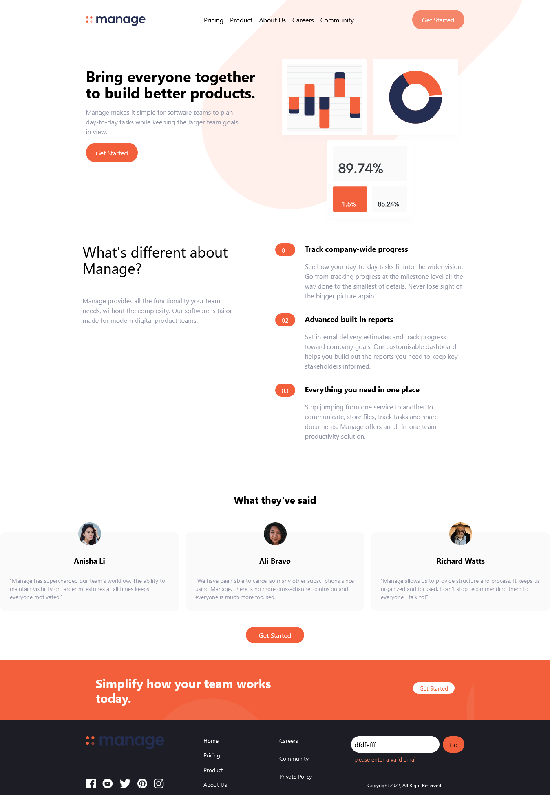

# Frontend Mentor - Manage landing page solution

This is a solution to the [Manage landing page challenge on Frontend Mentor](https://www.frontendmentor.io/challenges/manage-landing-page-SLXqC6P5). Frontend Mentor challenges help you improve your coding skills by building realistic projects. 

## Table of contents

- [Overview](#overview)
  - [The challenge](#the-challenge)
  - [Screenshot](#screenshot)
  - [Links](#links)
- [My process](#my-process)
  - [Built with](#built-with)
  - [What I learned](#what-i-learned)
  - [Continued development](#continued-development)
  - [Useful resources](#useful-resources)
- [Author](#author)
- [Acknowledgments](#acknowledgments)


## Overview

### The challenge

Users should be able to:

- View the optimal layout for the site depending on their device's screen size
- See hover states for all interactive elements on the page
- See all testimonials in a horizontal slider
- Receive an error message when the newsletter sign up `form` is submitted if:
  - The `input` field is empty
  - The email address is not formatted correctly

### Screenshot




### Links

- Live Site URL: [Click here](https://livinghopedev.github.io/manage-landing-page/)

## My process

### Built with

- Semantic HTML5 markup
- CSS custom properties
- Flexbox
- Mobile-first workflow
- [Taiwindcss](https://tailwindcss.com/)
- [swiperjs](https://swiperjs.com
) - Carousel library

### What I learned

During the course of building this landing page, I learnt how to utilize the tailwindcss framework in building web applications.
- I also learnt the importance of using "inline fold" extension.
- I learnt how to add carousel to a web application and how to modify some existing html codes to achieve the required designs.

To see how you can add code snippets, see below:

```html
<div class="swiper mySwiper flex flex-col  mt-16 md:space-x-4 md:hidden">
      <div class="swiper-wrapper">
        <!-- 1st testimonial -->
        <div class="swiper-slide">
          <div class="flex flex-col items-center p-6 mt-10 mb-10 space-y-6 bg-veryLightGray rounded-xl">
            
            <h5 class="font-bold text-lg">Anisha Li</h5>
            <p class="text-sm text-darkGrayishBlue">
              “Manage has supercharged our team's workflow. The ability to maintain
              visibility on larger milestones at all times keeps everyone motivated.”
            </p>
          </div>

        </div>
      </div>
</div>
```

### Useful resources

- [Example resource 1](https://codesandbox.io/s/hoyjrj?file=/index.html) - This helped me for carousel design. I really liked this pattern and will use it going forward.
- [Example resource 2](https://www.youtube.com/watch?v=4oyj_smPAjc&t=89s) - This is an amazing video which helped me figure out how to use the swiperjs library.


## Author

- Frontend Mentor - [Myusername](https://www.frontendmentor.io/profile/LivingHopeDev)
- Twitter - [@Myusername](https://www.twitter.com/adewobiadetayo)


